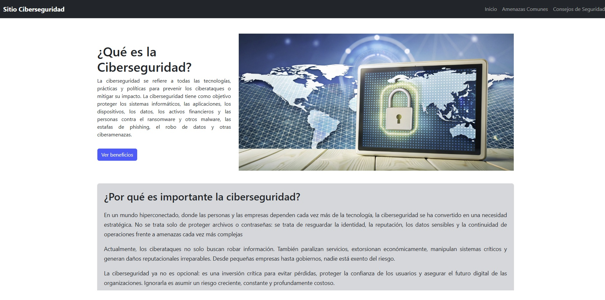

# Sitio Web sobre Ciberseguridad

Este proyecto es parte del módulo de desarrollo web del bootcamp. Consiste en un sitio informativo sobre ciberseguridad, desarrollado con HTML, CSS, JavaScript, Bootstrap y jQuery.

## Objetivo

Informar a los usuarios sobre:
- Qué es la ciberseguridad.
- Cuáles son las amenazas más comunes (phishing, malware, ransomware, DDoS).
- Consejos y buenas prácticas para protegerse en línea.

## Páginas del sitio

- **Inicio**: Introducción a la ciberseguridad, imagen destacada y navegación.
- **Amenazas Comunes**: Descripción de tipos de ataques, tarjetas y carrusel con ejemplos reales.
- **Consejos de Seguridad**: Lista de recomendaciones, formulario de contacto con validación y un test interactivo (modal).

## Visualización del Sitio

  

## Tecnologías utilizadas

- HTML5 y CSS3
- Bootstrap 5
- JavaScript
- jQuery
- Git y GitHub

## Estructura inicial del proyecto
- Index.html
- Amenazas.html
- Consejos.html
- Asses
	-CSS
	-JS
	-IMG
- .gitignore
- README

## Autor

Catalina Villegas - Bootcamp Phyton/Django - 2025